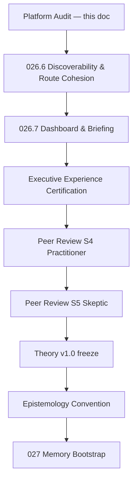

# LocalBrain Platform Audit — Gap & Navigation Report

> **Auditor:** Burt (Cursor)  
> **Date:** 2026-06-28  
> **Trigger:** Peer Review Sessions 1–3 complete · Session 4 (Executive Practitioner) **paused** until platform map is synchronized with implementation  
> **Binding rule:** No new Phase 2 cognitive features until this audit’s remediation slices are scheduled  
> **Authoritative execution map:** [Build Slice Queue v2.0](./LOCALBRAIN_BUILD_SLICE_QUEUE_V2.md) · [Phase Checklist](./PHASE_CHECKLIST.md)  
> **Legacy (superseded):** [MASTER_BUILD_PLAN.md](./MASTER_BUILD_PLAN.md)

---

## Executive summary

LocalBrain has completed **Phase 1 certification (LB-OS-026.5)** with a live migration lifecycle, Executive Question registry, and measurable integration cohesion. The **conceptual foundation is stabilizing** (three peer reviews passed without ontology reopening). The **platform map has drifted** from implementation in predictable ways: stale queue entries, slice ID collisions, surfaces outside the canonical registry, flat migration navigation in the shell, and uneven cross-links between migration stages.

**Strategic recommendation:** Enter **platform consolidation mode** — fix navigation and route coherence before Session 4 or LB-OS-027.

| Workstream | Status | Key finding |
| ---------- | ------ | ----------- |
| **A — Master Build Plan** | ✅ Complete | Phase 1 binding scope 100% shipped; full v2 roadmap ~35% implemented; queue table stale at LB-OS-006+ |
| **B — Navigation** | ✅ Complete | All routes smoke-pass; migration forward hub strong; reverse/cross-links uneven; `/learn` orphan-adjacent |

**Certification baseline (LB-OS-026.5):**

| Metric | Value |
| ------ | ----- |
| Platform Stability | ~95% |
| Platform Readiness | ~78% |
| Executive Maturity | ~29% |
| Architecture Volatility | ~6% |
| Integration audit `targets_met` | **true** |
| Cross-route links | 91 |
| Orphan pages (EQ gate) | 0 |
| Extended route smoke | 19/19 pass |

---

## Workstream A — Master Build Plan Audit

### A.1 Authoritative documents

| Document | Role | Health |
| -------- | ---- | ------ |
| [LOCALBRAIN_BUILD_SLICE_QUEUE_V2.md](./LOCALBRAIN_BUILD_SLICE_QUEUE_V2.md) | Authoritative execution map | ⚠️ **Needs revision** — glance table stale (006+ marked READY; 027–032 collide with Phase 2 memory arc) |
| [PHASE_CHECKLIST.md](./PHASE_CHECKLIST.md) | Living tracker | ✅ Accurate through 026.5; documents ID reconciliation note |
| [MASTER_BUILD_PLAN.md](./MASTER_BUILD_PLAN.md) | Legacy | 🔴 **Superseded** — do not execute |
| [LOCALBRAIN_BUILD_SLICE_QUEUE.md](./LOCALBRAIN_BUILD_SLICE_QUEUE.md) | v1 queue | 🔴 **Superseded** — LB-SLICE-002+ retired |

### A.2 Phase 1 binding scope — slice classification (LB-OS-001–026.5)

All slices in the **Phase 1 + Migration + Certification** gate are shipped.

| Slice | Name | Classification | Notes |
| ----- | ---- | -------------- | ----- |
| LB-OS-001 | Repo scaffold | **Complete** | |
| LB-OS-002 | OS shell + briefing | **Complete but needs polish** | Mock briefing sections until LB-OS-089 |
| LB-OS-003 | Permission engine | **Complete** | |
| LB-OS-004 | Workspace registry | **Complete** | L1 maturity — chief recommendations planned |
| LB-OS-106 | Module loader | **Complete** | MODULARITY GATE |
| LB-OS-005 | Knowledge Explorer | **Complete but needs polish** | Manual re-index not in UI |
| LB-OS-006 | Digital Asset Registry | **Complete** | Queue still says READY — doc drift |
| LB-OS-007 | Digital Asset Intelligence | **Complete** | |
| LB-OS-008 | OpenAI chat layer | **Complete** | |
| LB-OS-009 | File read/summarize | **Complete** | |
| LB-OS-010 | Approval-gated file mgmt | **Complete** | |
| LB-OS-010.5 | Chief of Staff layer | **Complete** | |
| LB-OS-011 | System health | **Complete but needs polish** | Partial mode in surface registry |
| LB-OS-012 | Engineering Studio | **Complete but needs polish** | Specialist routing UI stub |
| LB-OS-012.5 | Program Office | **Complete** | |
| LB-OS-013 | Writing Studio | **Partial** | LLM draft path stub |
| LB-OS-014 | Data Studio | **Partial** | External sources planned |
| LB-OS-015 | Relationship Studio | **Partial** | Seed catalog only |
| LB-OS-016 | Executive OS V1 | **Complete** | |
| LB-OS-017 | AI Provider Management | **Complete** | Live at `/system/providers` |
| LB-OS-018 | Migration planner | **Complete** | |
| LB-OS-019 | Filesystem audit | **Complete** | |
| LB-OS-019.5 | EPO sync (ENG-BLD-001) | **Complete** | |
| LB-OS-019.6 | Live surface audit (ENG-SRF-001) | **Complete** | |
| LB-OS-019.7 | Experience maturity (ENG-EXP-001) | **Complete** | |
| LB-OS-020 | Consolidation briefing | **Complete but needs polish** | Programs/Knowledge evidence tabs stub |
| LB-OS-020.5 | Integration pass (ENG-EQ-001) | **Complete** | |
| LB-OS-021 | Workspace architecture | **Complete** | |
| LB-OS-022 | Digital land survey | **Complete** | |
| LB-OS-023 | Migration proof | **Complete** | |
| LB-OS-024 | Migration planning | **Complete** | |
| LB-OS-025 | Executive approval | **Complete** | |
| LB-OS-026 | Cutover execution | **Complete** | |
| LB-OS-026.5 | Phase 1 certification | **Complete** | Four-metric readiness |

**Binding scope tally (34 slices):**

| Classification | Count | % |
| -------------- | ----- | - |
| Complete | 26 | 76% |
| Complete but needs polish | 5 | 15% |
| Partial (studios) | 3 | 9% |
| Stub only | 0 | 0% |
| Not started | 0 | 0% |
| Superseded | 0 | 0% |

### A.3 Full Build Slice Queue v2 — roadmap classification (LB-OS-001–105+)

| Classification | Est. count | % | Examples |
| -------------- | ---------- | - | -------- |
| **Implemented** | ~38 | 33% | 001–026.5 spine, provider spine, asset registry |
| **Complete but needs polish** | ~8 | 7% | Briefing mock, consolidation tabs, explorer re-index |
| **Partial** | ~5 | 4% | Studios 013–015, settings preferences |
| **Stub only** | ~3 | 3% | `/learn`, provider adapter placeholders (061–062) |
| **Not started** | ~58 | 50% | OJT 027–032 (legacy IDs), optimization 033–040, token economy 049–057, neural lab 066–075, executive office 087–096 |
| **Superseded / obsolete** | ~4 | 3% | MASTER_BUILD_PLAN, queue v1, duplicate LB-OS-066/067 rows in v2 table, legacy OJT 027–032 IDs vs Phase 2 memory 027–035 |

### A.4 Master Build Plan health

Two scopes — do not conflate:

**Scope 1 — Phase 1 binding gate (what Steve can use today):**

```text
Implemented (code shipped)     100%   (34/34 checklist slices)
Needs polish (live + gaps)      24%   (8 surfaces with stub_sections)
Live surface mode ratio          68%   (13/19 registry surfaces in "live" mode)
```

**Scope 2 — Full v2 enterprise roadmap (LB-OS-001–105+):**

```text
Implemented                    33%
Needs Revision                  6%   (queue glance table, slice ID collisions)
Obsolete                        3%   (legacy plans, duplicate queue rows)
Missing / Not started          58%
```

The **~87% figure** from certification maps to **platform stability (~95%)** and **near-complete Phase 1 feature delivery**, not to the full 105-slice enterprise roadmap.

### A.5 Dependency drift

| Planned slice | Original dependency | Current state | Verdict |
| ------------- | ------------------- | ------------- | ------- |
| LB-OS-006 | 005 | Shipped as part of Phase 1 | **Still needed** — update queue status only |
| LB-OS-007 | 006 | Shipped | **Satisfied** |
| LB-OS-027 (OJT) | 016 | Phase 2 redefined 027 as Executive Memory Bootstrap | **Merge / renumber** — OJT → LB-OS-027-OJT or Phase 4 block 127–132 |
| LB-OS-027–032 (Memory) | Peer review + Convention | Gated — no code | **Still needed** — authoritative in PHASE_CHECKLIST Phase 2 |
| LB-OS-033 (EQ Router) | Memory arc | Partially satisfied by ENG-EQ-001 (020.5) | **Still needed** — deepen routing, sub-route EQ split |
| LB-OS-089 (Briefing composer) | 088 chain | Mock sections on `/` today | **Still needed** — partial pre-work exists |
| LB-OS-010 | 005, 008 | Renumbering note in queue | **Obsolete doc note** — already complete as 009/010 |

### A.6 Architectural drift inventory

| Drift type | Finding | Severity |
| ---------- | ------- | -------- |
| **Duplicate slice IDs** | LB-OS-027–032 used for OJT (queue v2) and Executive Memory (PHASE_CHECKLIST Phase 2) | 🔴 High — blocks clean Burt packets |
| **Duplicate queue rows** | LB-OS-066, LB-OS-067 appear twice in v2 glance table | 🟡 Medium |
| **Surfaces outside registry** | `/learn`, `/system/providers` routed but absent from `SURFACE_REGISTRY` | 🟡 Medium |
| **EQ granularity** | Migration sub-stages (021–026) share EQ-014/015 as `summary_only_routes`; user examples used EQ-016–019 (not in code) | 🟡 Medium — Session 4 discoverability |
| **Duplicate navigation** | `/migration` hub duplicates all stage links; individual stages also link forward — intentional hub, not duplicate routes | 🟢 Low |
| **Registry vs router** | 20 registry entries vs 24+ live routes (modules, learn, providers, redirects) | 🟡 Medium |
| **Learn stub mislabel** | `LearnStub` cites LB-OS-026; should cite OJT arc or Phase 2 memory gate | 🟢 Low |
| **`studio/*` catch-all** | Redirects unknown studio paths to `/` — registered modules load first (OK today, fragile) | 🟡 Medium |

### A.7 Technical debt inventory (top items)

| ID | Area | Debt | Affects |
| -- | ---- | ---- | ------- |
| TD-001 | Executive Briefing | `MOCK_BRIEFING_SECTIONS` on home | EQ-001 confidence |
| TD-002 | Surface registry | `/learn`, `/system/providers` not registered | EPO accuracy, maturity scoring |
| TD-003 | Build Slice Queue v2 | Glance table status stale from 006 onward | Burt packet assignment |
| TD-004 | Slice ID namespace | OJT 027–032 vs Memory 027–035 | Governance, commits, EPO |
| TD-005 | DepartmentNav | Flat `/migration` only — no lifecycle sub-nav | Executive discoverability |
| TD-006 | Migration cross-links | Consolidation, audit lack reverse links to full chain | Reverse navigation |
| TD-007 | Consolidation briefing | Programs/Knowledge evidence providers stub | EQ-005 depth |
| TD-008 | Studio modules | Learn tab stub in all four studios | OJT / Phase 2 gate |
| TD-009 | AiProvidersView | No `ExecutiveQuestionShell` — uses `LiveSurfaceBanner` only | Shell consistency |
| TD-010 | Settings | Teach Me toggle not persisted (LB-OS-028) | OJT readiness |
| TD-011 | Knowledge Explorer | POST `/index/run` not exposed in UI | EQ-004 |
| TD-012 | Integration audit | `/settings`, `/system/providers` excluded from orphan check by convention — undocumented | Audit completeness |

---

## Workstream B — Navigation Audit

### B.1 Route registry (canonical)

| Route | Status | Owner slice | Live | EQ | Shell | Links in (nav) | Links out (in-view) | Issues |
| ----- | ------ | ----------- | ---- | -- | ----- | -------------- | ------------------- | ------ |
| `/` | Valid | LB-OS-002 | Partial | EQ-001 | ✅ | Sidebar Briefing | workspace, program-office, consolidation, EQ hub | Mock sections (TD-001) |
| `/workspace/:id` | Valid | LB-OS-004 | Live | EQ-007 | ✅ | Sidebar Workspace | briefing | |
| `/project/:id` | Redirect | LB-OS-004 | — | — | — | Legacy bookmarks | → `/workspace/:id` | Alias OK |
| `/explorer` | Valid | LB-OS-005 | Live | EQ-004 | ✅ | Sidebar Explorer | EQ cross-links | Re-index UI missing |
| `/learn` | Placeholder | — | Stub | **None** | ❌ | Sidebar Learn | toggle only | **Not in registry**; no EQ |
| `/actions` | Valid | LB-OS-010 | Live | EQ-013 | ✅ | Sidebar Actions | EQ cross-links | |
| `/program-office` | Valid | LB-OS-012.5 | Live | EQ-002 | ✅ | Sidebar | EQ cross-links | No inline migration links |
| `/system` | Valid | LB-OS-011 | Partial | EQ-003 | ✅ | Sidebar System | EQ cross-links | |
| `/system/providers` | Valid | LB-OS-017 | Live | EQ-003* | ⚠️ | Settings stub link | system (back) | *summary route; no EQ shell |
| `/migration` | Valid | LB-OS-018 | Live | EQ-014 | ✅ | Sidebar Migration | **all 9 stages** | Forward hub ✅ |
| `/migration/audit` | Valid | LB-OS-019 | Live | EQ-015 | ✅ | Migration hub only | consolidation | Weak reverse |
| `/migration/consolidation` | Valid | LB-OS-020 | Live | EQ-005 | ✅ | Migration hub, briefing | PO, migration | **Missing** arch/audit/survey links |
| `/migration/workspace-architecture` | Valid | LB-OS-021 | Live | EQ-014† | ✅ | Migration hub | audit, consolidation, survey, planner | †summary route |
| `/migration/digital-land-survey` | Valid | LB-OS-022 | Live | EQ-015† | ✅ | Migration hub | arch, proof, planning, audit | |
| `/migration/proof` | Valid | LB-OS-023 | Live | EQ-014† | ✅ | Migration hub | survey, arch, planning | |
| `/migration/planning` | Valid | LB-OS-024 | Live | EQ-014† | ✅ | Migration hub | proof, survey, approval, cutover | |
| `/migration/approval` | Valid | LB-OS-025 | Live | EQ-014† | ✅ | Migration hub | planning, proof, cutover | |
| `/migration/cutover` | Valid | LB-OS-026 | Live | EQ-014† | ✅ | Migration hub | approval, planning | Terminal — OK |
| `/settings` | Valid | LB-OS-002 | Partial | — | ❌ | Sidebar Settings | providers (text) | No EQ shell |
| `/studio/engineering` | Valid | LB-OS-012 | Partial | EQ-010 | ✅ | Sidebar module | EQ cross-links | |
| `/studio/writing` | Valid | LB-OS-013 | Partial | EQ-011 | ✅ | Sidebar module | EQ cross-links | |
| `/studio/data` | Valid | LB-OS-014 | Partial | EQ-012 | ✅ | Sidebar module | EQ cross-links | |
| `/studio/relationships` | Valid | LB-OS-015 | Partial | EQ-006 | ✅ | Sidebar module | EQ cross-links | |
| `/studio/*` (unregistered) | Redirect | — | — | — | — | — | → `/` | Fragile catch-all |
| `*` (unknown) | Redirect | — | — | — | — | — | → `/` | Bookmark safety OK |

**Route smoke:** 19/19 extended migration + core routes pass (`platformReadiness.test.ts`).

### B.2 Migration lifecycle chain verification

**Expected forward path:**

```text
Executive Office (/)
  → Program Office (/program-office)
  → Migration (/migration)
  → Audit (/migration/audit)
  → Consolidation (/migration/consolidation)
  → Workspace Architecture (/migration/workspace-architecture)
  → Digital Land Survey (/migration/digital-land-survey)
  → Proof (/migration/proof)
  → Planning (/migration/planning)
  → Approval (/migration/approval)
  → Cutover (/migration/cutover)
  → Launch (026 complete — cutover is terminal execution surface)
```

| Segment | Forward | Reverse | Verdict |
| ------- | ------- | ------- | ------- |
| `/` → PO | Link in briefing header | PO → EQ-001 via cross-links | ✅ |
| PO → Migration | EQ-002 cross-links | Migration → PO breadcrumb | ✅ |
| Migration → Audit | Hub link | Audit → Migration crumb only | ⚠️ Partial reverse |
| Audit → Consolidation | Link | Consolidation → Audit **missing** | 🔴 Gap |
| Consolidation → Architecture | **No direct link** | Architecture → Consolidation | ⚠️ One-way |
| Architecture → Survey | Link | Survey → Architecture | ✅ |
| Survey → Proof | Link | Proof → Survey | ✅ |
| Proof → Planning | Link | Planning → Proof | ✅ |
| Planning → Approval | Link | Approval → Planning | ✅ |
| Approval → Cutover | Link | Cutover → Approval | ✅ |

**Shell sidebar:** Only `/migration` — sub-stages reachable via hub or deep link, **not** from DepartmentNav. Treat as **Missing** shell entries for executive lifecycle.

### B.3 Link audit summary

| Category | Count | Notes |
| -------- | ----- | ----- |
| **Valid** | 22 | All registered routes render |
| **Broken** | 0 | No 404s in smoke suite |
| **Wrong destination** | 0 | |
| **Placeholder** | 1 | `/learn` |
| **Duplicate** | 0 | Hub + stage links intentional |
| **Missing** | 6+ | Consolidation↔audit; shell sub-nav; registry entries for learn/providers |
| **Needs redirect** | 0 | `/project/:id` alias works |

### B.4 Executive Question routing (bidirectional)

**Phase 1 questions:** 13 (EQ-001–007, EQ-010–015; no EQ-008, EQ-009, EQ-016–019 in code).

#### Surface → Question (forward)

| Surface | EQ | Capability | Maturity |
| ------- | -- | ---------- | -------- |
| Executive Briefing | EQ-001 | Daily executive orientation | Partial (L2) |
| Program Office | EQ-002 | Build progress & readiness | Live (L2) |
| System Health | EQ-003 | Machine & ops health | Partial (L2) |
| AI Providers (`/system/providers`) | EQ-003† | Provider spine management | Live — †not in registry |
| Knowledge Explorer | EQ-004 | Information location | Live (L2) |
| Consolidation Briefing | EQ-005 | Consolidation opportunity | Live (L3) |
| Relationship Studio | EQ-006 | Relationship attention | Partial (L1) |
| Living Workspace | EQ-007 | Project drift | Live (L1) |
| Engineering Studio | EQ-010 | Engineering health | Partial (L2) |
| Writing Studio | EQ-011 | Writing pipeline | Partial (L1) |
| Data Studio | EQ-012 | Data source gaps | Partial (L1) |
| Actions | EQ-013 | Approval queue | Live (L2) |
| Migration Planner | EQ-014 | Migration strategy | Live (L2) |
| Workspace Architecture | EQ-014† | Logical workspace planning | Live (L3) — †summary |
| Migration Proof | EQ-014† | Safety certification | Live (L3) — †summary |
| Migration Planning | EQ-014† | Constraint-aware planning | Live (L3) — †summary |
| Executive Approval | EQ-014† | Executive authorization | Live (L3) — †summary |
| Migration Cutover | EQ-014† | Controlled execution | Live (L4) — †summary |
| Filesystem Audit | EQ-015 | Physical storage mapping | Live (L2) |
| Digital Land Survey | EQ-015† | Boundary & orphan survey | Live (L3) — †summary |
| Learn | — | OJT academy | **Stub — no EQ** |
| Settings | — | Preferences & safety | Partial — no EQ |

#### Question → Surface (inverse)

| EQ | Authoritative page | APIs | Shared models | Nav entry | Related Qs | Maturity | Last slice |
| -- | ------------------ | ---- | ------------- | --------- | ---------- | -------- | ---------- |
| EQ-001 | `/` | `/api/v1/acceptance`, `/api/consolidation/opportunity` | `V1AcceptanceReport`, briefing mocks | Briefing | 7 links | Partial | LB-OS-020.5 |
| EQ-002 | `/program-office` | `/api/epo/*`, `/api/integration/audit` | EPO overview, checklist parser | Program Office | 7 links | Live | LB-OS-012.5 |
| EQ-003 | `/system` | `/api/system/health` | Health metrics | System | 7 links | Partial | LB-OS-011 |
| EQ-004 | `/explorer` | `/api/knowledge-explorer/*` | Metadata index | Explorer | 7 links | Live | LB-OS-005 |
| EQ-005 | `/migration/consolidation` | `/api/consolidation/*` | EIC, consolidation score | **Not in sidebar** — via migration/briefing | 7 links | Live | LB-OS-020 |
| EQ-006 | `/studio/relationships` | `/api/relationship-network/*` | Seed catalog | Relationships module | 7 links | Partial | LB-OS-015 |
| EQ-007 | `/workspace/:id` | `/api/workspaces/:id/*` | LivingWorkspace | Workspace | 7 links | Live | LB-OS-004 |
| EQ-010 | `/studio/engineering` | `/api/engineering/*` | Engineering overview | Engineering module | 7 links | Partial | LB-OS-012 |
| EQ-011 | `/studio/writing` | `/api/writing/*` | Writing sources | Writing module | 7 links | Partial | LB-OS-013 |
| EQ-012 | `/studio/data` | `/api/data-intelligence/*` | Source catalog | Data module | 7 links | Partial | LB-OS-014 |
| EQ-013 | `/actions` | `/api/actions/*` | proposed_actions | Actions | 7 links | Live | LB-OS-010 |
| EQ-014 | `/migration` | `/api/migration/*` (pipeline) | Migration planner → cutover | Migration | 7 links | Live | LB-OS-018–026 |
| EQ-015 | `/migration/audit` | `/api/migration/audit`, `/api/migration/digital-land-survey` | Audit + survey | **Via migration hub only** | 7 links | Live | LB-OS-019–022 |

**EQ routing gaps:**

- Migration sub-stages share EQ-014/015 — practitioners cannot ask "where is approval?" and get EQ-018 (not defined).
- `/learn` has no question mapping.
- EQ-005 (Consolidation) has no sidebar entry — discoverable only through briefing or migration hub.

### B.5 Home page (Executive Dashboard) audit

| Check | Result |
| ----- | ------ |
| Live consolidation card | ✅ `fetchConsolidationOpportunity` |
| V1 milestone banner | ✅ `fetchV1Acceptance` |
| Stale mock sections | 🔴 `MOCK_BRIEFING_SECTIONS` — Daily priorities etc. |
| Dead buttons | ✅ None found |
| Placeholder percentages | ⚠️ EQ-001 `answer_confidence: 55` reflects mock state |
| Executive Question Hub | ✅ Live cross-links |
| Program Office link | ✅ |

### B.6 URL consistency

| Check | Result |
| ----- | ------ |
| Duplicate URLs | None |
| Legacy `/project/:id` | Redirects to workspace ✅ |
| `studio/*` unknown | Redirects to `/` |
| Unknown paths | Redirect to `/` |
| Deep links to migration stages | ✅ Smoke-pass |
| Bookmark safety | ✅ No 404s; unknown → home |

---

## Prioritized implementation sequence (updated 2026-06-28)

**Binding post-audit order** — no new architectural concepts until consolidation complete:

| # | Slice | Name | Rationale |
| - | ----- | ---- | --------- |
| 1 | **LB-OS-026.6** | Executive Discoverability & Route Cohesion | Six objectives · journey tests · [Experience Certification](./LOCALBRAIN_EXECUTIVE_EXPERIENCE_CERTIFICATION.md) — [Burt packet](./burt_packets/LB-OS-026.6.md) |
| 2 | **LB-OS-026.7** | Executive Dashboard & Daily Briefing | Replace mock briefing; sync live metrics (TD-001) |
| 3 | — | Executive Experience Certification | Completion artifact from 026.6; re-run after 026.7 |
| 4 | — | Peer Review Session 4 | Executive Practitioner — resume when certified |
| 5 | — | Peer Review Session 5 | Skeptic |
| 6 | — | Theory v1.0 freeze | Five gate questions |
| 7 | — | Executive Epistemology Convention | Five sessions |
| 8 | **LB-OS-027** | Executive Memory Bootstrap | H-027 · first Phase 2 cognitive code |

**Subsequent consolidation (post–Session 4):**

| # | Slice | Name |
| - | ----- | ---- |
| 9 | LB-OS-033 | Executive Question Router |
| 10 | LB-OS-026.8+ | Digital Twin v1 runtime · observability · debt sprint |

**Immediate pre-code actions (no slice ID):**

1. Reconcile BUILD_SLICE_QUEUE_V2 glance table with PHASE_CHECKLIST (006+ status).
2. Resolve LB-OS-027 namespace — renumber OJT arc to 127–132 or `LB-OJT-027`.

---

## Dependency analysis (build order)



**Hard gates (unchanged):**

- No LB-OS-027 cognitive code until Theory v1.0 frozen + Convention complete.
- Executive OS v1.0 architecture frozen — navigation work is **cohesion**, not foundational redesign.

---

## Artifacts produced

| Artifact | Location |
| -------- | -------- |
| Gap & Next Slice Report | This document §A |
| Route Registry | This document §B.1 |
| Executive Capability Matrix | This document §B.4 |
| Cross-link audit | This document §B.2–B.3 |
| Technical debt inventory | This document §A.7 |
| Top 10 slices | This document — Prioritized list |
| Build dependency analysis | This document — Dependency diagram |

**Machine-readable sources of truth:**

- `backend/src/liveSurface/surfaceRegistry.ts` — surface maturity
- `shared/src/executiveQuestion.ts` — EQ registry + cross-links
- `backend/src/integration/integrationAudit.ts` — cohesion metrics
- `frontend/src/router.tsx` — route table
- `frontend/src/shell/DepartmentNav.tsx` — shell navigation

---

## Recommendation to Steve

Pause **Session 4 (Executive Practitioner)** until **LB-OS-026.6** (Executive Discoverability & Route Cohesion) and **026.7** (Dashboard & Daily Briefing) complete and **Executive Experience Certification** passes. Session 4 asks *"Does this help an executive?"* — that question cannot be answered fairly while capabilities are hard to find and the home briefing still serves mock priorities.

The theory peer review proved the **brain** is stabilizing. This audit proves the **body** needs a discoverability pass before the practitioner walks the floor.

**Next slice:** [LB-OS-026.6 Burt packet](./burt_packets/LB-OS-026.6.md) — six objectives · journey tests · fifth platform metric (Executive Experience).
